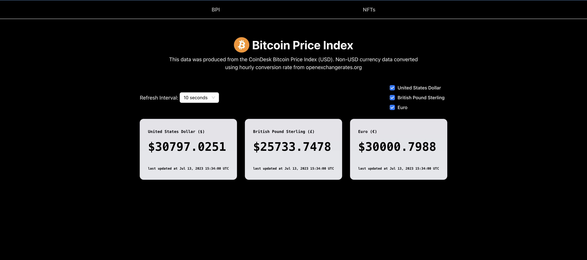
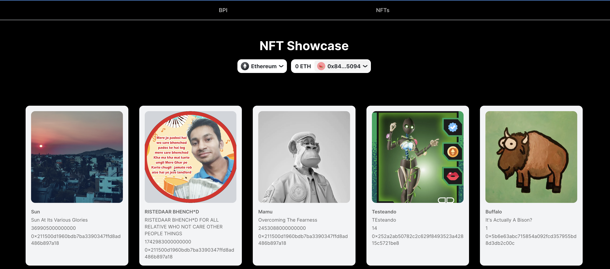

## Getting Started

First, run the development server:

```bash
npm run dev
# or
yarn dev
# or
pnpm dev
```

Open [http://localhost:3000](http://localhost:3000) with your browser to see the
result.

You can start editing the page by modifying `app/page.tsx`. The page
auto-updates as you edit the file.

This project uses
[`next/font`](https://nextjs.org/docs/basic-features/font-optimization) to
automatically optimize and load Inter, a custom Google Font.

The data below was gotten from a test address

#### Desktop

- Home Page



- NFT Page



### Link

- Live Site URL: [Website Link](https://insomonia-lab-test.vercel.app/)

## My process

### Built with

- Nextjs
- Wagmi
- RainbowKit
- TypeScript
- TailwindCSS

## Author

- Website - [Aliu Salaudeen](https://insomonia-lab-test.vercel.app/)
- GitHub- [@aliiiu](https://github.com/aliiiu)
